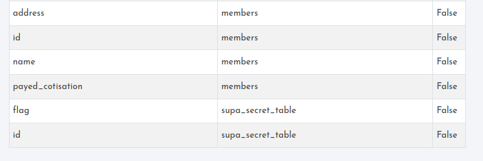
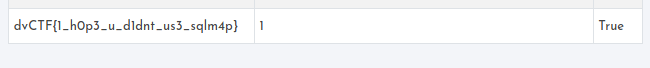

# Soal

Can you get more information about the members?

<http://challs.dvc.tf:1337/members>

Solusi

Setelah menyelesaikan chall sebelumnya kita dihadapkan untuk mengetahui informasi pada tab members. Awalnya begitu kebingungan dengan xss, sql, ssti tidak muncul apapun. Karena stuck saya melakukan fuzzing/intruder attack dengan burpsuite muncul respon yang berbeda ketika menggunakan sql injection dengan payload " or ""=" .  Salah satu tim saya peka terhadap hal ini, dengan payload tersebut kita ternyata berada pada jalan yang salah karena diawal menggunakan payload dengan petik satu (') , dilanjutkan dengan menggunakan union attack dan dicek apa saja tabel yang terdapat pada database dan didapatkan seperti ini

Coba kita lihat apa isi pada tabel supa_secret_table dan muncul yang kita cari dengan payload ini :
    " union select group_concat(flag),1,1 from supa_secret_table -- -

    Flag : dvCTF{1_h0p3_u_d1dnt_us3_sqlm4p}
